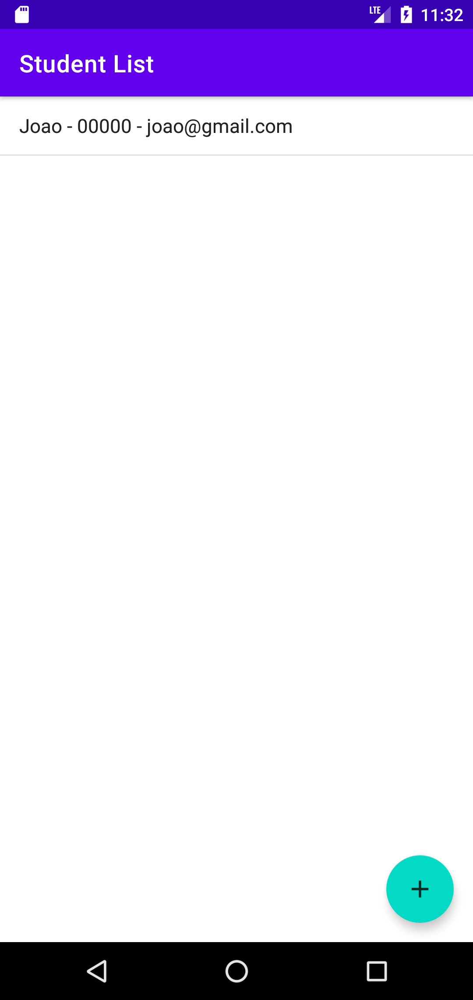
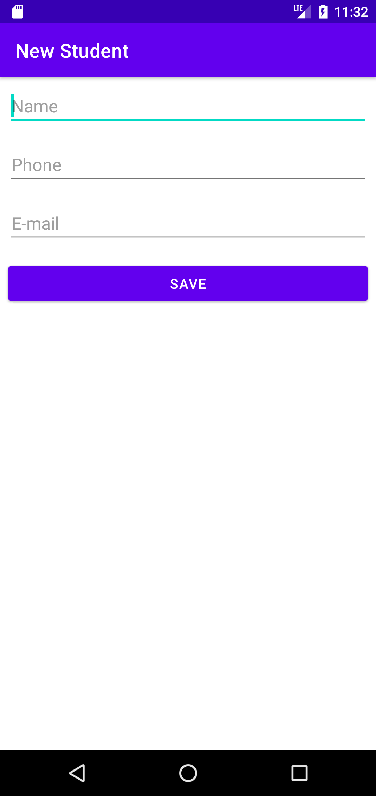

# Android 

## Uma aplicação para praticar os conceitos de:
- Iniciar e finalizar uma activity;
- Praticar ciclos de vidas de uma aplicação como onCreate e onResume;
- DAO pattern;
- Layouts DSL;
- Configurações e conceitos do gradlew.

## Alura
Construção do app seguindo curso "Formação Android - Android parte 1 - Crie a sua primeira app mobile" da Alura.

## Imagens do projeto

